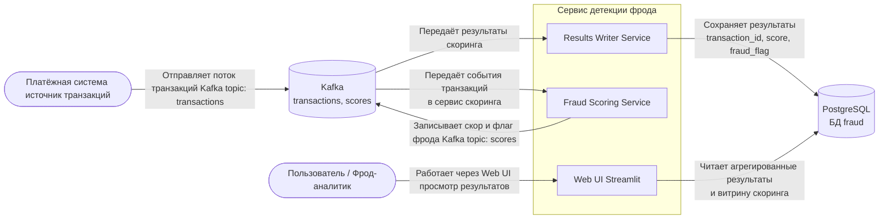

# Архитектура сервиса детекции фрода

Ниже приведены диаграммы в C4:

- **Уровень 1 — Контекст системы**
- **Уровень 3 — Компоненты** (c детализацией основного сервиса скоринга)

---

## 1. Контекстная диаграмма (C4 — Уровень 1)

1. Платёжная система публикует события транзакций в Kafka-топик transactions.
2. Сервис детекции фрода читает эти события, скорит моделью и пишет результаты в топик scores.
3. Сервис записи результатов (sink) читает топик scores и сохраняет результаты в PostgreSQL.
4. Пользователь / фрод-аналитик через Streamlit UI просматривает последние фродовые транзакции и распределение скоров.

## 2. Контекстная диаграмма (C4 — Уровень 3)

```mermaid
flowchart LR
    subgraph ext_kafka[Kafka Cluster]
      kafka_broker[(Kafka Broker)]
      topic_tx[(Topic: transactions)]
      topic_scores[(Topic: scores)]
    end

    subgraph ext_db[PostgreSQL DB]
      db_scores[(Table: scores transaction_id, score, fraud_flag)]
    end

    ui_user([Пользователь браузер])

    subgraph producer_svc[producer service]
      producer[Kafka Producer отправляет в topic transactions]
    end

    subgraph scoring_svc[scorer]
      kc[Kafka Consumer читает topic transactions]
      prep[Preprocess feature]
      model[Model Inference CatBoost]
      kp[Kafka Producer пишет topic scores]
    end

    subgraph sink_svc[sink]
      sink_cons[Kafka Consumer читает topic scores]
      sink_repo[Postgres Writer запись в таблицу scores]
    end

    subgraph ui_svc[ui Streamlit]
      ui_app[Streamlit App dashboards, график]
    end

    subgraph kafka_ui_svc[kafka-ui]
      kafka_ui_app[Kafka Web UI]
    end

    producer -->|Отправляет сообщения<br/>о транзакциях| topic_tx
    topic_tx -->|Читает события| kc

    kc -->|транзакция| prep
    prep -->|Матричный вид X| model
    model -->|score| kp
    kp -->|Публикует сообщения<br/>transaction_id, score, fraud_flag| topic_scores

    topic_scores -->|Читает результаты скоринга| sink_cons
    sink_cons -->|transaction_id, score, fraud_flag| sink_repo
    sink_repo -->|INSERT| db_scores

    ui_user -->|HTTP Streamlit| ui_app
    ui_app -->|SELECT последних N записей,<br/>распределение скоров| db_scores

    kafka_ui_app -->|Читает метаданные и сообщения<br/>из брокера| kafka_broker

    kc --- kafka_broker
    kp --- kafka_broker
    sink_cons --- kafka_broker
    db_scores --- ext_db
```

Сервис Scorer:
1. читает сообщения из transactions;
2. выполняет препроцессинг транзакции;
3. вызывает ML-модель и получает score;
4. применяет порог и формирует fraud_flag;
5. публикует результат в Kafka-топик scores.

Сервис Sink:
1. читает сообщения из scores;
2. сохраняет (transaction_id, score, fraud_flag) в таблицу scores в PostgreSQL.

Streamlit-приложение читает данные из таблицы scores:
1. последние 10 транзакций с fraud_flag == 1;
2. последние 100 скоров (для построения гистограммы распределения).

Интерфейс отображает:
1. таблицу фродовых транзакций;
2. гистограмму распределения скоров.